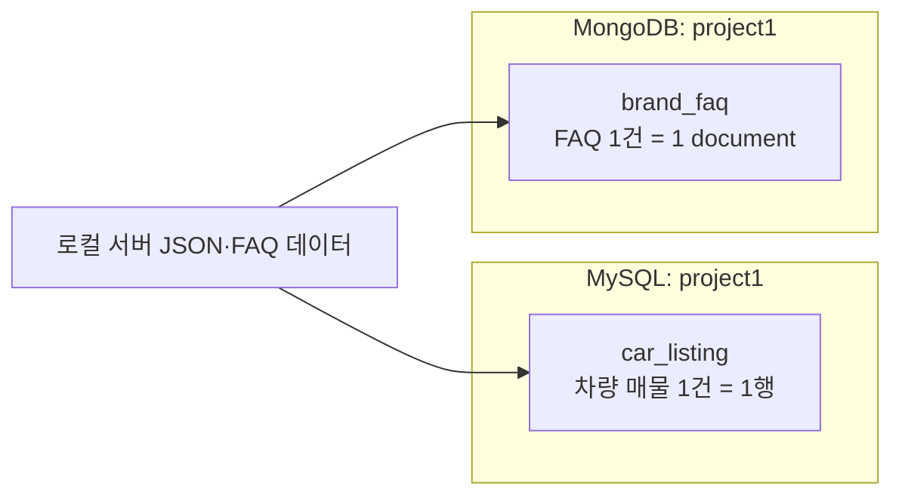
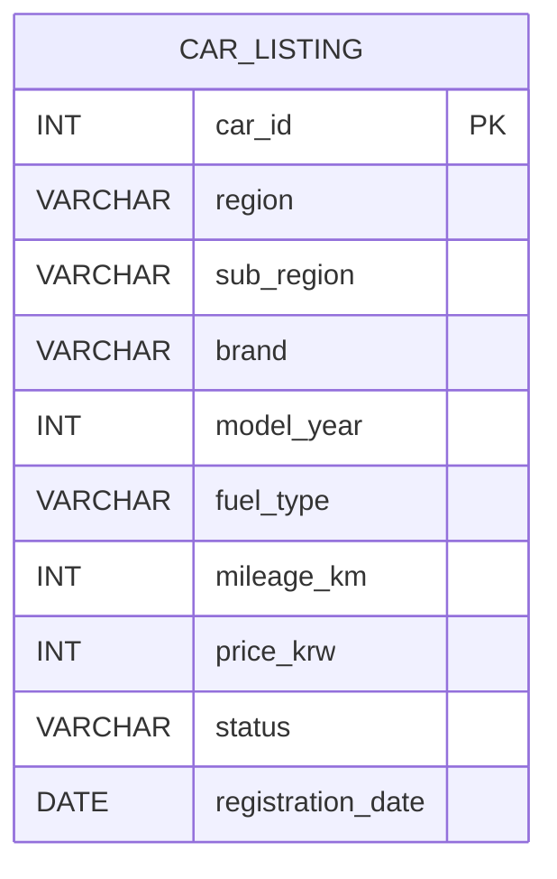

# 차량정보·FAQ 저장소 ERD

## 1. 기준

| 구분 | 기준 |
|---|---|
| MySQL 데이터베이스 | `project1` |
| MySQL 테이블 | `car_listing` |
| MongoDB 데이터베이스 | `project1` |
| MongoDB 컬렉션 | `brand_faq` |
| 차량 1건 | MySQL 테이블의 1행(row) |
| FAQ 1건 | MongoDB collection의 1개 document |

차량정보와 FAQ는 저장 방식이 다르므로 분리한다. 차량정보는 숫자와 조건 검색이 중심이어서 MySQL에 저장하고, FAQ는 질문과 답변이 들어 있는 문서 형태이므로 MongoDB에 저장한다.

현재 차량과 FAQ 사이에 직접적인 외래 키 관계를 두지 않는다.

## 2. 전체 구조



## 3. MySQL ERD

### 3.1 `project1.car_listing`



### 3.2 컬럼 정의

| 컬럼 | 타입 | 필수 | 설명 |
|---|---|---:|---|
| `car_id` | `INT` | 예 | 차량 고유 번호. 기본 키로 사용한다. |
| `region` | `VARCHAR(50)` | 예 | 광역 지역. 예: `인천광역시` |
| `sub_region` | `VARCHAR(50)` | 예 | 기초 지역. 예: `서구` |
| `brand` | `VARCHAR(50)` | 예 | 차량 브랜드. 예: `기아` |
| `model_year` | `INT` | 예 | 차량 연식. 예: `2018` |
| `fuel_type` | `VARCHAR(30)` | 예 | 연료. 예: `전기` |
| `mileage_km` | `INT` | 예 | 주행거리(km). 예: `91516` |
| `price_krw` | `INT` | 예 | 가격(원). 예: `17300000` |
| `status` | `VARCHAR(20)` | 예 | 판매 상태. `AVAILABLE`, `RESERVED`, `SOLD` |
| `registration_date` | `DATE` | 예 | 차량 등록일. 예: `2018-01-05` |

### 3.3 키와 인덱스

```sql
USE project1;

PRIMARY KEY (car_id)
KEY idx_car_search (region, sub_region, brand, model_year)
```

- `PRIMARY KEY`: 차량을 구분하는 고유값이다. 같은 `car_id`를 두 번 저장할 수 없다.
- `idx_car_search`: 지역, 기초지역, 브랜드, 연식으로 자주 조회할 때 사용하는 검색용 인덱스다.
- 자동차 테이블에는 현재 다른 테이블을 참조하는 외래 키가 없다.

### 3.4 실제 테이블 생성 SQL

```sql
CREATE DATABASE IF NOT EXISTS project1;
USE project1;

CREATE TABLE IF NOT EXISTS car_listing (
    car_id            INT         PRIMARY KEY,
    region            VARCHAR(50) NOT NULL,
    sub_region        VARCHAR(50) NOT NULL,
    brand             VARCHAR(50) NOT NULL,
    model_year        INT         NOT NULL,
    fuel_type         VARCHAR(30) NOT NULL,
    mileage_km        INT         NOT NULL,
    price_krw         INT         NOT NULL,
    status            VARCHAR(20) NOT NULL,
    registration_date DATE        NOT NULL
);

CREATE INDEX idx_car_search
    ON car_listing (region, sub_region, brand, model_year);
```

## 4. MongoDB 구조

### 4.1 `project1.brand_faq`

FAQ는 하나의 질문과 답변을 하나의 document로 저장한다.

```javascript
use project1;

db.brand_faq.insertOne({
  _id: "local-faq-001",
  source_id: "local-faq",
  faq_id: "faq-001",
  brand_en: "hyundai",
  brand: "현대",
  category: "보증",
  question: "보증 기간은 어떻게 되나요?",
  answer: "차량별 보증 기준을 확인합니다.",
  source_url: "https://example.com/faq",
  collected_at: "2026-08-11"
});
```

### 4.2 document 필드 정의

| 필드 | 설명 |
|---|---|
| `_id` | MongoDB document 식별자 |
| `source_id` | 원본 source 식별자 |
| `faq_id` | FAQ 식별자 |
| `brand_en` | 영문 기업명 |
| `brand` | 기업명 |
| `category` | FAQ 카테고리 |
| `question` | 질문 |
| `answer` | 답변 |
| `source_url` | 원본 링크 |
| `collected_at` | 수집일 |

### 4.3 인덱스와 조회

```javascript
use project1;

db.brand_faq.createIndex(
  { source_id: 1, faq_id: 1 },
  { unique: true }
);

db.brand_faq.createIndex(
  { brand_en: 1, brand: 1, category: 1 }
);

db.brand_faq.find(
  { brand: "현대", category: "보증" },
  { _id: 0, question: 1, answer: 1 }
);
```

- `source_id`, `faq_id` 인덱스: 같은 원본의 같은 FAQ 중복 저장을 막는다.
- `brand`, `category` 인덱스: 기업별·카테고리별 FAQ 조회를 빠르게 한다.
- 현재 차량 테이블과 FAQ collection 사이에는 직접적인 관계가 없으므로 JOIN이나 외래 키를 사용하지 않는다.

## 5. 원본 JSON과 저장 컬럼 대응

```text
id                         → car_id
location.province          → region
location.city              → sub_region
brand.name                 → brand
modelYear                  → model_year
fuelType                   → fuel_type
mileageKm                  → mileage_km
price                      → price_krw
status                     → status
firstRegistration          → registration_date
```

FAQ는 다음 기준으로 document를 만든다.

```text
식별자      → _id
source 식별자 → source_id
FAQ 식별자  → faq_id
영문 기업명 → brand_en
기업명      → brand
카테고리    → category
질문        → question
답변        → answer
원본 링크   → source_url
수집일      → collected_at
```

## 6. Day21 확인 범위

1. `project1` 데이터베이스에 `car_listing` 테이블을 생성한다.
2. 차량 JSON 한 건을 `car_listing`의 한 행으로 적재한다.
3. `SELECT`로 차량 행을 확인한다.
4. `project1` 데이터베이스의 `brand_faq` collection에 FAQ document 한 건을 저장한다.
5. 두 저장소의 기본 키와 인덱스가 동작하는지 확인한다.
