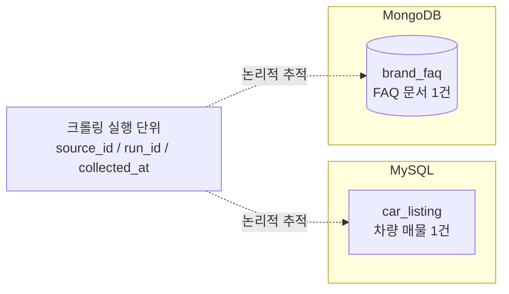
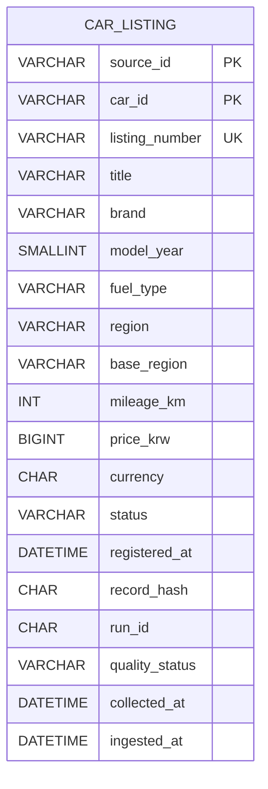

# 차량정보·FAQ 저장소 ERD

## 1. 기준 문서

- 기준 DDL 문서: `carStorage.md`
- 차량정보 저장소: MySQL
- FAQ 저장소: MongoDB
- 현재 반영 범위: 차량 목록 `car_listing`, FAQ `brand_faq`
- 상태: Draft

차량정보와 FAQ는 데이터 구조 및 조회 방식이 다르므로 저장소를 분리한다. 현재 두 저장소 사이에 직접적인 FK 관계는 두지 않고, 각 데이터에 포함된 `source_id`, `run_id`, 수집 시각을 통해 크롤링 실행 단위로 추적한다.

## 2. 논리 구조



## 3. MySQL ERD: `car_listing`



### 3.1 컬럼 정의

| 컬럼명 | 타입 | 필수 | 설명 |
|---|---|---:|---|
| `source_id` | VARCHAR(100) | 예 | source 식별자 |
| `car_id` | VARCHAR(64) | 예 | API `id` 또는 HTML `data-car-id` |
| `listing_number` | VARCHAR(64) | 예 | 매물번호, 예: `UC-00094191` |
| `title` | VARCHAR(200) | 예 | 목록 제목 |
| `brand` | VARCHAR(80) | 예 | 브랜드 |
| `model_year` | SMALLINT | 예 | 연식 |
| `fuel_type` | VARCHAR(40) | 아니오 | 연료 |
| `region` | VARCHAR(50) | 예 | 광역 지역, 예: `서울특별시` |
| `base_region` | VARCHAR(50) | 예 | 기초 지역, 예: `강남구` |
| `mileage_km` | INT | 예 | 주행거리(km) |
| `price_krw` | BIGINT | 예 | 가격(원) |
| `currency` | CHAR(3) | 아니오 | 통화 코드, 예: `KRW` |
| `status` | VARCHAR(20) | 예 | `AVAILABLE`, `RESERVED`, `SOLD` |
| `registered_at` | DATETIME | 예 | 등록일 |
| `record_hash` | CHAR(64) | 예 | 원천 record 내용 hash |
| `run_id` | CHAR(36) | 예 | 크롤링 실행 식별자 |
| `quality_status` | VARCHAR(20) | 예 | 품질검증 상태 |
| `collected_at` | DATETIME | 예 | 수집 시각 |
| `ingested_at` | DATETIME | 예 | 저장 완료 시각 |

### 3.2 키와 인덱스

```sql
PRIMARY KEY (source_id, car_id)
UNIQUE KEY uq_car_listing_number (source_id, listing_number)
KEY idx_car_filter (status, brand, region, base_region, model_year)
KEY idx_car_price (status, price_krw)
KEY idx_car_run (run_id)
```

### 3.3 자동차 데이터 적재 규칙

- `source_id + car_id`가 같으면 같은 차량으로 판단하고 MySQL upsert한다.
- 같은 `record_hash`면 변경이 없는 것으로 보고 `skipped` 처리한다.
- `record_hash`가 달라지면 목록 필드를 갱신한다.
- 필수값 검증에 실패한 record는 `car_listing`에 적재하지 않는다.
- `listing_number`가 같은 source 내에서 중복되면 적재 전에 오류 처리한다.
- 화면의 페이지 순번인 `번호`는 저장하지 않는다.

## 4. MongoDB 모델: `brand_faq`

FAQ card 하나를 MongoDB document 하나로 저장한다.

```json
{
  "_id": "<source_id>:<faq_id>",
  "source_id": "<source_id>",
  "faq_id": "hyundai-support-001",
  "brand_id": "hyundai",
  "brand": "현대",
  "category": "고객지원",
  "question": "FAQ 질문 heading",
  "answer": "FAQ 답변 paragraph",
  "source_url": "<official-source-url>",
  "source_checked_at": "2026-08-11",
  "content_hash": "<sha256>",
  "run_id": "<run-id>",
  "quality_status": "pass",
  "collected_at": "<ISO-8601>",
  "ingested_at": "<ISO-8601>"
}
```

### 4.1 필드 정의

| 필드명 | 타입 | 필수 | 설명 |
|---|---|---:|---|
| `_id` | String | 예 | `<source_id>:<faq_id>` 형식의 문서 식별자 |
| `source_id` | String | 예 | source 식별자 |
| `faq_id` | String | 예 | FAQ 식별자 |
| `brand_id` | String | 예 | source가 제공하는 영문 브랜드 코드 |
| `brand` | String | 예 | 화면에 표시되는 기업·브랜드명 |
| `category` | String | 예 | FAQ 카테고리 |
| `question` | String | 예 | 질문 heading |
| `answer` | String | 예 | 답변 본문 |
| `source_url` | String | 예 | 공식 source URL |
| `source_checked_at` | Date/String | 예 | source 확인일 |
| `content_hash` | String | 예 | FAQ content hash |
| `run_id` | String | 예 | 크롤링 실행 식별자 |
| `quality_status` | String | 예 | 품질검증 상태 |
| `collected_at` | Date/String | 예 | 수집 시각 |
| `ingested_at` | Date/String | 예 | 저장 완료 시각 |

### 4.2 FAQ 적재 규칙

- `source_id + faq_id`를 unique key로 사용한다.
- 같은 `content_hash`면 변경 없음으로 보고 `skipped` 처리한다.
- `content_hash`가 달라지면 동일 FAQ document를 update한다.
- 질문·답변·공식 source URL·확인일이 없는 document는 적재하지 않는다.

## 5. FAQ 기업명 및 카테고리 설계

FAQ의 기업명과 카테고리는 모두 고정된 ENUM이나 필수 master table로 제한하지 않는다. 새로운 기업·브랜드 또는 카테고리가 추가되거나 삭제되어도 MongoDB 컬렉션 구조 변경 없이 문서 값을 관리한다.

### 5.1 기업명 변경 정책

기업명은 화면에 표시되는 이름과 source가 제공하는 영문 브랜드 코드를 분리한다.

| 필드 | 역할 | 예시 |
|---|---|---|
| `brand_id` | source가 제공하는 영문 브랜드 코드 | `hyundai` |
| `brand` | 현재 표시되는 기업·브랜드명 | `현대` |

정책은 다음과 같다.

- 신규 기업이 추가되면 source 제공 `brand_id`와 표시명 `brand`를 함께 저장한다.
- 기업명이 변경되면 source가 제공하는 최신 `brand_id`와 `brand`를 반영한다.
- 기업이 삭제되거나 source에서 더 이상 제공되지 않으면 신규 수집 대상에서 제외한다.
- 기존 문서를 물리적으로 삭제할지는 보존 정책에 따라 결정하며, 기본적으로는 `quality_status` 또는 별도 활성 상태로 비활성 처리하는 방식을 권장한다.
- `brand_id`와 `brand` 어느 값도 FAQ의 business key나 단독 UNIQUE KEY로 사용하지 않는다.

`brand_id`를 source에서 제공하지 않는 경우에는 source별 보완 규칙을 별도로 정의해야 한다. `brand_id`는 영문 브랜드 코드이므로 기업의 영구적인 내부 식별자로 간주하지 않는다.

현재 예시 카테고리:

- 고객지원
- 차량구매
- 차량관리
- MY GENESIS 앱
- 중고차 등록
- 내비게이션
- 운행
- 보증연장
- KGM LINK
- My BMW 앱
- 리콜
- 디지털 서비스

카테고리 정책은 다음과 같다.

- 신규 카테고리는 별도 스키마 변경 없이 문자열 값으로 추가한다.
- 더 이상 사용하지 않는 카테고리는 신규 수집에서 제외한다.
- 기존 FAQ document의 카테고리를 일괄 변경할지는 source 변경 이력과 업무 정책에 따라 결정한다.
- 하나의 FAQ가 여러 카테고리에 동시에 속해야 하면 이후 `categories: []` 배열 구조로 확장할 수 있다.

### 5.2 별도 기업 master collection을 두지 않는 이유

현재 범위에서는 FAQ document 안에 기업 식별자와 표시명을 함께 저장한다. 기업 목록만 관리하기 위한 별도 `faq_companies` collection을 추가하면 기업명 변경 이력과 문서 참조 관계를 별도로 관리해야 하므로 초기 구조가 복잡해진다.

다음 요구가 생기면 별도 collection을 추가할 수 있다.

- 기업별 담당자·상태·정렬순서 관리
- 기업명 변경 이력 관리
- 기업별 권한 관리
- FAQ 외 다른 데이터와 기업 master 공유

## 6. 인덱스

### MySQL

```sql
CREATE UNIQUE INDEX uq_car_listing_number
    ON car_listing (source_id, listing_number);

CREATE INDEX idx_car_filter
    ON car_listing (status, brand, region, base_region, model_year);

CREATE INDEX idx_car_price
    ON car_listing (status, price_krw);

CREATE INDEX idx_car_run
    ON car_listing (run_id);
```

### MongoDB

```javascript
db.brand_faq.createIndex(
  { source_id: 1, faq_id: 1 },
  { unique: true }
);

db.brand_faq.createIndex(
  { source_id: 1, brand_id: 1, category: 1 }
);

db.brand_faq.createIndex(
  { source_id: 1, brand: 1 }
);
```

질문·답변 full-text index는 실제 검색 요구가 확정된 이후 추가한다.

## 7. 지역 정보 구조

지역 정보는 `region`과 `base_region`으로 분리해 저장한다.

| 컬럼 | 의미 | 예시 |
|---|---|---|
| `region` | 광역 지역 | `서울특별시` |
| `base_region` | 기초 지역 | `강남구` |

원천 주소에서 지역과 기초지역을 각각 추출·표준화하며, 두 값을 파싱하지 못한 경우에는 품질검증에서 오류 또는 보류 상태로 처리한다.

## 8. 추가 확정이 필요한 영역

- 크롤링 실행 이력 테이블 또는 collection
- source registry 구조
- evidence 및 실패 로그 저장 위치
- `quality_status`의 허용 상태값
- `status` 코드의 향후 확장 여부
- `source_checked_at`, `collected_at`, `ingested_at`의 timezone 정책
